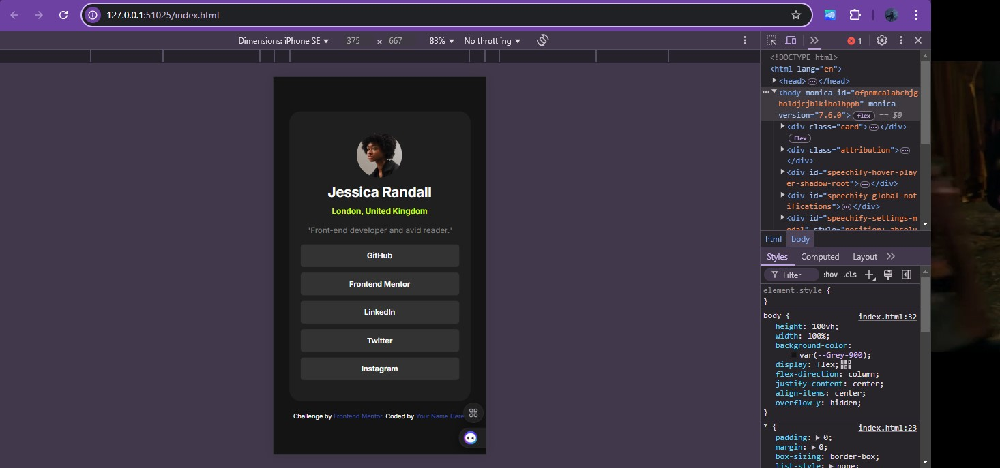
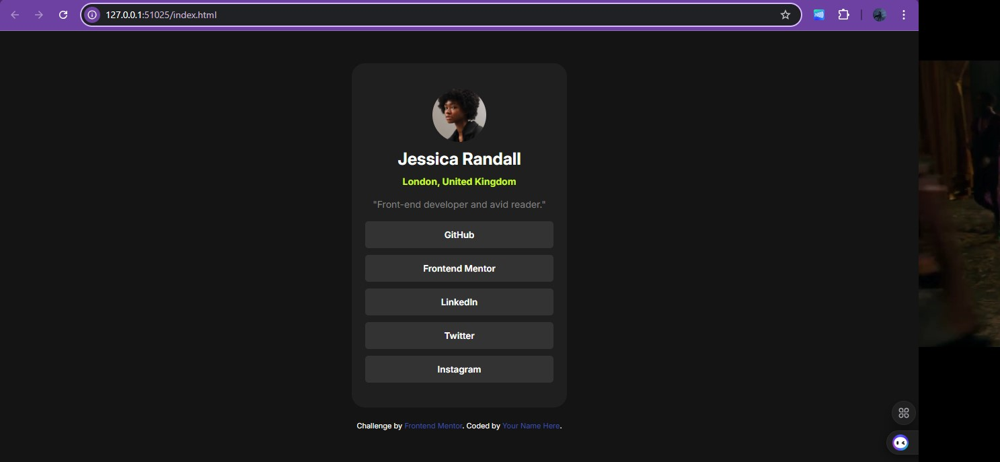

# Frontend Mentor - Social links profile solution

This is a solution to the [Social links profile challenge on Frontend Mentor](https://www.frontendmentor.io/challenges/social-links-profile-UG32l9m6dQ). Frontend Mentor challenges help you improve your coding skills by building realistic projects. 

### The challenge

Users should be able to:

- See hover and focus states for all interactive elements on the page

### Screenshot

- Solution URL: (https://github.com/Othniel-Nduka/socialLinkProfile)
- Live Site URL: (https://social-link-profile-beta-ruby.vercel.app/)

### Built with

- Semantic HTML5 markup
- CSS custom properties
- Flexbox
- Mobile-first workflow

- Frontend Mentor - [@Othniel-Nduka](https://www.frontendmentor.io/profile/Othniel-Nduka)

